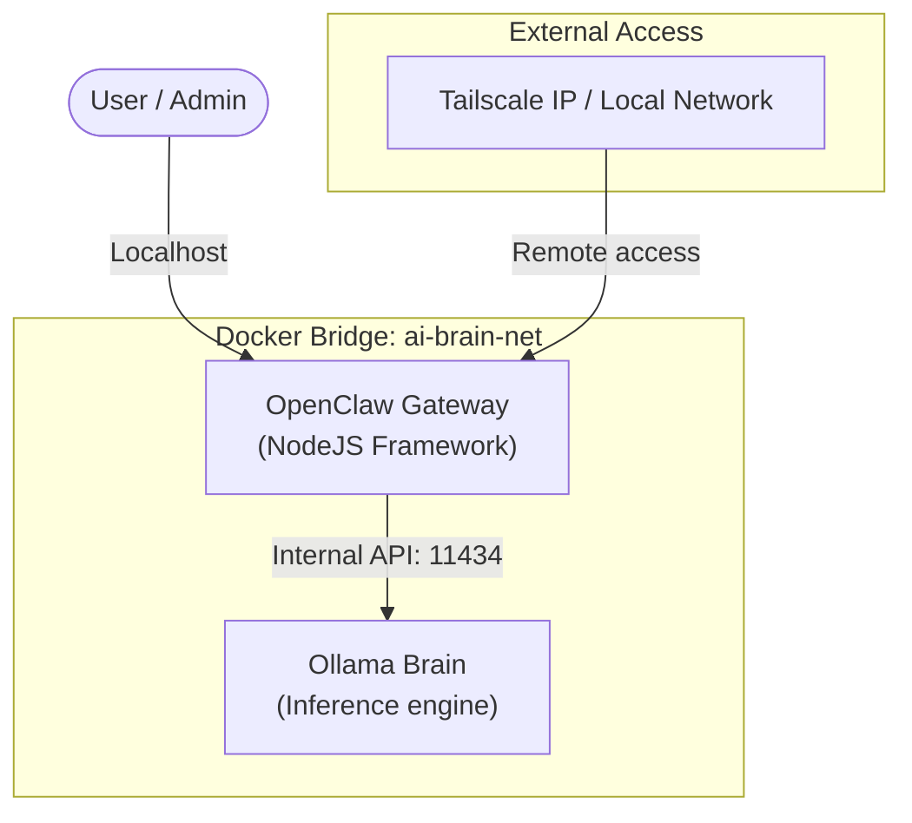

# AI Hub: OpenClaw + Ollama Docker Deployment Guide

A comprehensive guide for managing local AI agents via **OpenClaw** and **Ollama**, and connecting safely over local networks or meshes like **Tailscale**.

---

## 🏗️ 1. Architecture

Your setup runs purely on local resources inside a locked-down virtual network bridging the Inference and Gateway:



---

## 🐳 2. Docker Setup & Services

Your deployment leverages two distinct containers communicating over `ai-brain-net`.

### Container Information

| Service | Port | Native Path | Config File |
| :--- | :--- | :--- | :--- |
| **Ollama Brain** | `11434` | `/root/.ollama` | Internal env vars |
| **OpenClaw Gateway** | `18789` | `/root/.openclaw` | `openclaw-docker/openclaw.json` |

### Service Configurations (`docker-compose.yml`)

-   **Ollama GPU**: If you have a larger GPU, setup is manageable in `.env`.
-   **CPU Only**: Current defaults utilize all 8 CPU cores/threads with `OLLAMA_NUM_THREADS=8` and `OLLAMA_FLASH_ATTENTION=1` for maximum efficiency on i5-8250U style builds.

---

## 🧠 3. Loading Models into Ollama

Every agent requires a backend model inside the **Ollama Brain** container.

### 📥 Managing Models

Use the provided `Makefile` helper commands on your host system:

```bash
# Pull the default model (e.g., qwen2.5:1.5b / qwen2.5:0.5b)
make model

# Pull a specific model for coding tasks
make model MODEL=qwen2.5-coder:7b

# Check current downloaded models
make model-list
```

> [!TIP]
> **Performance Tip**: Avoid pulling `7B` or larger models unless you have a dedicated GPU supporting over 6GB of VRAM or are prepared for slow CPU speeds. Sticking with `3B` or `1.5B` delivers snappy responses on strictly CPU platforms.

---

## 🤖 4. Registering Agents & Models in OpenClaw

When Ollama downloads a model, **OpenClaw must be made aware of it** via `/openclaw-docker/openclaw.json`. 

### Step 4.1: Register the Model in Providers

Scroll down to `"models"` key and append your downloaded model tag:

```json
"models": {
  "mode": "merge",
  "providers": {
    "ollama": {
      "baseUrl": "http://ollama-brain:11434/v1",
      "api": "openai-completions",
      "models": [
        {
          "id": "qwen2.5-coder:7b",
          "name": "Qwen2.5 Coder 7B",
          "reasoning": false,
          "contextWindow": 32768
        }
      ]
    }
  }
}
```

### Step 4.2: Pair the Agent to the Model

Under `"agents.list"`, find your agent role (e.g., `backend` or `analyst`) and assign the model ID leveraging the format `ollama/<id>`:

```json
{
  "id": "backend",
  "name": "Backend Developer",
  "model": {
    "primary": "ollama/qwen2.5-coder:7b",
    "fallbacks": [
      "ollama/qwen2.5:3b"
    ]
  },
  "identity": {
    "emoji": "⚙️",
    "theme": "Ruby on Rails backend specialist"
  }
}
```

> [!IMPORTANT]
> Always use `ollama/` followed by the exact model ID found in your `providers` block.

---

## 📡 5. Remote Access (Tailscale, VPN, Local Networks)

To access the Gateway UI (`http://<server-ip>:18789`) from outside the local host machine, update your CORS allowed origins.

### Step 5.1: Modify `openclaw.json` Gateway Config

Open `/openclaw-docker/openclaw.json` and adjust the `"controlUi"` block to whitelist your access methods:

```json
"gateway": {
  "mode": "local",
  "port": 18789,
  "bind": "lan",
  "controlUi": {
    "allowedOrigins": [
      "http://localhost:18789",
      "http://192.168.1.100:18789",   // 🟢 Local LAN IP
      "http://100.101.253.100:18789"  // 🟢 Tailscale Mesh IP
    ]
  }
}
```

### Step 5.2: Applying Configurations

Any edits to `openclaw.json` require a restart to avoid cache reads:

```bash
# Hot restart OpenClaw container only (avoids unloading models in Ollama)
make restart-openclaw
```

---

## 🔐 SSH Connections & Tunnels

If you cannot bind using Tailscale fully, construct an SSH Forwarding Tunnel from your remote control device:

```bash
# Forward remote port 18789 to your current laptop's absolute local port
ssh -L 18789:localhost:18789 nicolasmd@<server-ip-or-tailscale>
```

Navigate to `http://localhost:18789` on your laptop, and Docker will serve it transparently to your host bridge.
